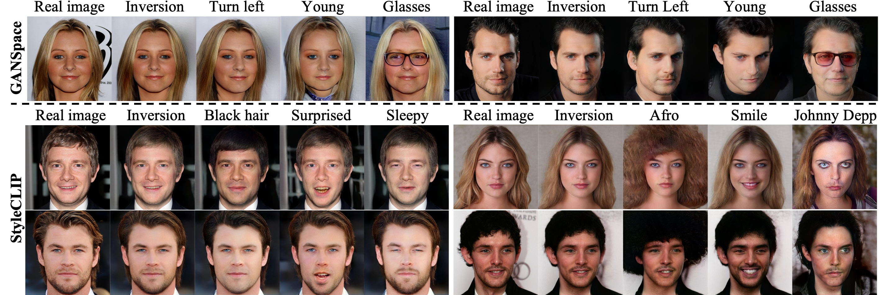

# [CVPR 2024] Diversity-aware Channel Pruning for StyleGAN Compression

### [Paper](https://arxiv.org/abs/2403.13548) / [Project Page](https://jiwoogit.github.io/DCP-GAN_site/)


---
## Usage

**To test our code, please follow these steps:**

1. [Setup](#setup)
2. [Pruning](#pruning)
3. [Train](#train)
4. [Inference](#inference)
5. [Evaluation](#evaluation)


### Pre-trained weights

If you want to test our lightweight model only, please download the pre-trained model from this [link](https://drive.google.com/drive/folders/189irmL8OMkynCeu4-XLPq8OGGvCNoiFA?usp=sharing) and proceed to the Inference step.

Note that some of our provided weights are larger than the teacher model. This is because our checkpoint contains the generator, generator_ema, and discriminator in a single .pt file.

## Setup

Our codebase is built on ([xuguodong03/StyleKD](https://github.com/xuguodong03/StyleKD) and [rosinality/stylegan2-pytorch](https://github.com/rosinality/stylegan2-pytorch)) and has similar architecture and dependencies.

I tested the code in the [pytorch/pytorch:1.8.1-cuda11.1-cudnn8-devel](https://hub.docker.com/layers/pytorch/pytorch/1.8.1-cuda11.1-cudnn8-devel/images/sha256-024af183411f136373a83f9a0e5d1a02fb11acb1b52fdcf4d73601912d0f09b1) Docker image.
Then, run:
```
pip install -r requirements.txt
```

## Pruning
run:
```
python prune.py
```
- **Pruning ratio ($p_r$)** is controlled by the `--remove_ratio` parameter. (default: 0.7)
- **Strength of perturbation ($\alpha$)** is controlled by the `--edit_strength` parameter. (default: 5.0)
- **The number of perturbations for each latent vector ($N$)** is controlled through the `--n_direction` parameter. (default: 10)

We use a total of 5000 samples for score calculation, but the results are similar when using over 1000 samples.

## Train
This execution assumes a 4-GPU setting.
```
CUDA_VISIBLE_DEVICES=0,1,2,3 python -m torch.distributed.launch --nproc_per_node=4 --master_port=8001 \
    distributed_train.py --name batch16_run0 \
    --load 0 --load_style 1 --g_step 0 \
    --kd_l1_lambda 3 --kd_lpips_lambda 3 --kd_simi_lambda 30 \
    --batch 4 --worker 8 \
    --teacher_ckpt ./Model/teacher_model/256px_full_size.pt \
    --student_ckpt ./Model/pruned_model/dcp_0.7_256px_a5.0_n10_t1.00_model.pt \
    --path /dataset/ffhq \
    --train_mode ffhq
```

## Inference
Download the weights from this [link](https://drive.google.com/drive/folders/189irmL8OMkynCeu4-XLPq8OGGvCNoiFA?usp=sharing) or train yourself, and run:
```
python generate.py --ckpt ./Model/student_model/dcp_ffhq256.pt
```

## Evaluation
For precision and recall (P&R), I utilized code from the [NVlabs/stylegan2-ada-pytorch](https://github.com/NVlabs/stylegan2-ada-pytorch) repository. Please refer to this repository for further details.


### L1 distance for teacher and student
```
python get_recon.py \
    --t ./Model/teacher_model/256px_full_size.pt \
    --s ./Model/student_model/dcp_ffhq256.pt
```

### FID
We utilize pre-calculated features for FID evaluation, accessible via this [link.](https://drive.google.com/drive/folders/1PqvIcAnVFvNyW_OTCwW0QceqNqayAhF0?usp=sharing)
Please copy the selected features to the "./Evaluation" directory before evaluation (FFHQ256 is already in the repository).
```
python get_fid.py --ckpt ./Model/student_model/dcp_ffhq256.pt --data_type ffhq # ffhq dataset
python get_fid.py --ckpt ./Model/student_model/dcp_horse.pt --data_type horse # lsun horse dataset
```

## Citation
I will update bibtex soon.
<!-- If you find our work useful, please consider citing and star: -->
```BibTeX
@article{chung2024diversity,
  title={Diversity-aware Channel Pruning for StyleGAN Compression},
  author={Chung, Jiwoo and Hyun, Sangeek and Shim, Sang-Heon and Heo, Jae-Pil},
  journal={arXiv preprint arXiv:2403.13548},
  year={2024}
}
```
